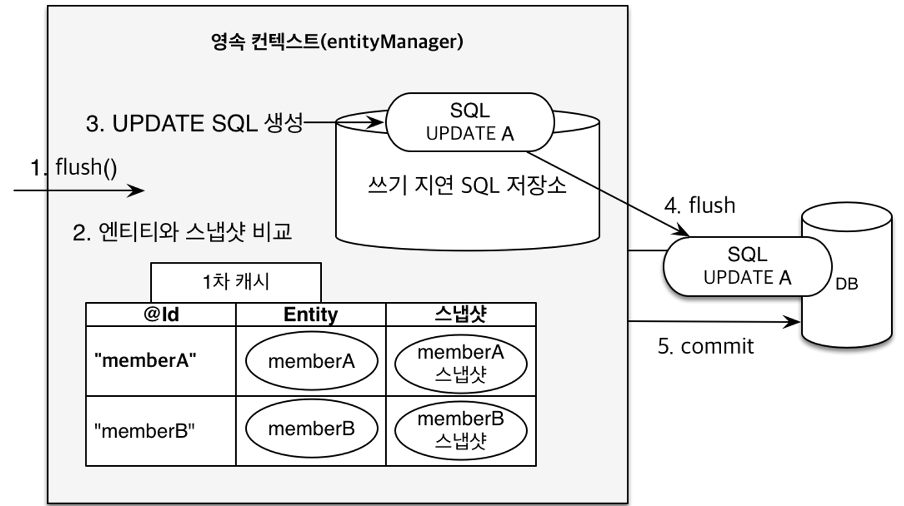

안녕하세요. Backend 팀 박은지입니다.<br>
현재 넥스트컬쳐에 신입(?)개발자로 입사한지 3개월이 넘었고, 프로젝트에도 참여하게 되었습니다.<br>
기존에도 개발자로 있었지만 웹하고는 관련이 없는 개발을 해서 뭔가 알 듯 하면서도 모르는 것들 투성이였습니다.<br>
<br>
그 중에 JPA를 중점적으로 학습을 하게 되어 해당 내용을 공유해 드리려고 합니다.<br>
기존에 JPA에 대한 설명이나 영상이 잘 되어 있는 것들이 많으므로<br>
제가 프로젝트를 하면서 직접 사용한 경험을 토대로 설명을 하고자 합니다.<br>

(팀원분들의 강의와 설명, 김영한 님의 자바 ORM 표준 JPA 프로그래밍 - 기본편 동영상 강의가 많은 도움이 되었습니다.)
## JPA 가 왜 필요하지?
```xml
<?xml version="1.0" encoding="UTF-8"?>
<!DOCTYPE mapper PUBLIC "-//mybatis.org//DTD Mapper 3.0//EN" "http://mybatis.org/dtd/mybatis-3-mapper.dtd" >
<mapper namespace="admin.mapper.AdminMapper">

	<insert id="insertAdmin" useGeneratedKeys="true" keyProperty="administratorSeq" parameterType="admin.vo.AdminAccessMenu">
		INSERT INTO Administrator (
			  administratorSeq
			, adminId
			, adminPassword
			, adminName
			, regDate
		) VALUES (
			  #{administratorSeq}
			, #{adminId}
			, #{adminPassword}
			, #{adminName}
			, NOW()
		)
    </insert>
```
(왠지 낯설지 않다....?)<br>

애플리케이션을 개발한다면 객체 지향 언어 (예를 들어 Java)와 관계형 데이터베이스 조합으로 진행을 많이 하고 있습니다. 그러나 이둘은 서로 지향하는 목적이 다르고 기능과 표현 방법도 다릅니다.

> 1. 상속<br>
객체는 상속이라는 기능이 있지만 테이블은 상속이라는 기능이 없다.<br>
> 2. 연관관계<br>
객체는 참조를 사용해서 연관된 객체를 조회하지만 테이블은 외래 키와 조인을 사용해서 연관된 테이블을 조회한다.<br>
>3. 객체 그래프 탐색<br>
객체는 관계가 있는 다른 객체를 자유로이 탐색할 수 있어야 하는데 위의 코드와 같이 SQL과 매퍼가 되는 순간 SQL의 결과에 따라 탐색할 수 있는 한도가 정해진다.
>4. 비교<br>
객체에는 동일성(identity)비교와 동등성(equality) 비교라는 두 가지 비교 방법이 있으며, 로우(row)로 구분하는 데이터베이스와 차이가 있다. 데이터베이스에서 같은 값을 조회 했더라도 다른 인스턴스에 값을 담으면 동일성이 다르다고 출력이 된다.<br>

이렇게 지향하는 바가 다르다보니 CRUD가 발생할 때 마다 클래스와 xml를 왔다갔다 하면서 자바 객체를 SQL로 혹은 SQL을 자바 객체로 반복적으로 코드를 작성 및 수정을 해야 합니다.<br>

이렇게 되면 결국 객체 모델링 보다는 데이터 중심의 모델로 변하게 됩니다.<br>

이러한 문제점을 해결하기 위해 나온 것이 바로 JPA입니다.<br>

## Hello JPA!
JPA는 Java Persistence API의 약자로 자바 진영의 ORM 표준 기술입니다.<br>
>ORM이 뭔가요?<br>
Object-relational mapping (객체 관계 매핑)의 약자입니다.<br>
객체는 객체대로 설계, 관계형 데이터베이스는 관계형 데이터베이스 대로 설계 할 수 있습니다.<br>
개발자가 했단 노가다를 ORM 프레임워크가 중간에서 매핑해 줍니다.<br>
대중적인 언어에서 대부분 ORM 기술이 존재합니다.<br>
(Sequelize(Node.js에서 많이 사용), Prisma 등이 있습니다. 출처 - https://velog.io/@alskt0419/ORM%EC%97%90-%EB%8C%80%ED%95%B4%EC%84%9C...-iek4f0o3fg)<br>

### 엔티티 매핑

```java
@Entity
@Table(name = "CONTACT")
@Getter
public class Contact {

    @Id
    @GeneratedValue(strategy = GenerationType.IDENTITY)
    private Long id;

    @Column(
            nullable = false,
            length = 100
    )
    private String title;

    @Lob
    @Column(nullable = false)
    private String content;
```
>객체와 테이블 매핑 : @Entity, @Table<br>
>기본 키 매핑 : @Id<br>
>필드와 컬럼 매핑 : @Column<br>
>연관관계 매핑 : @ManyToOne, @JoinColumn<br>

이러한 어노테이션 기능을 통해 JPA는 데이터베이스 스키마를 자동으로 생성하는 기능을 지원합니다.
또한, 어떤 데이터베이스를 쓰느냐에 따라 해당 데이터베이스에 맞춰서 생성해 줍니다.

### 영속 컨텍스트
<br>

영속성 컨텍스트가 엔티티를 관리하면 다음과 같은 장점이 있습니다.
>1. 1차 캐시<br>
>2. 동일성 보장<br>
>>1차 캐시로 반복 가능한 읽기(REPEATABLE READ) 등급의 트랜잭션 격리 수준을 데이터베이스가 아닌 애플리케이션 차원에서 제공 
>3. 트랜잭션을 지원하는 쓰기 지연<br>
>4. 변경 감지<br>
>5. 지연 로딩<br>

```java
@Test
    public void contactSearch() throws Exception {
        /*
			사용자 로그인 및 사용자 정보 담기
			관리자 로그인
		*/

        for (int i = 0; i < answer.size(); i++) {
            Contact entity = contactService.detail(answer.get(i));

            entity.answerEntity(getManager());
        }
       
	    entityManager.flush();
        entityManager.clear();
```

#### flush()
플러시는 영속성 컨텍스트의 변경 내용을 데이터베이스에 반영합니다. 

#### clear()
영속성 컨텍스트를 초기화해서 해당 영속성 컨텍스트의 모든 엔티티를 준영속 상태로 만듭니다.

### 다양한 연관관계 매핑

엔티티의 연관관계를 매핑할 때는 다음 3가지를 고려해야 합니다.
>1. 다중성<br>
>>다대일(*)<br>
>>일대다<br>
>>일대일<br>
>>다대다(실무에서 사용하기에는 한계가 있어서 거의 사용하지 않는다.)<br>
>>(*다대다의 경우 중간테이블을 이용해서 일대다, 다대일 관계로 작성합니다.)<br>
>2. 단방향, 양방향<br>
>3. 연관관계의 주인<br>
(연관관계의 주인은 mappedBy 속성을 사용하지 않습니다. 연관관계의 주인이 아니면 mappedBy 속성을 사용하고 연관관계의 주인 필드 이름을 값으로 입력해야 합니다.)

### 프록시
위에서 잠깐 언급했지만 객체는 관계가 있는 다른 객체를 자유로이 탐색할 수 있어야 합니다. (객체 그래프 탐색)<br>
그러나 객체는 실제 데이터베이스에 저장이 되므로, JPA에서는 이러한 문제를 해결하기 위해 프록시를 사용하게 되었습니다.<br>

프록시의 특징으로는 다음과 같습니다.<br>

>1. 실제 클래스를 상속 받아서 만들어진다.
>2. 실제 클래스와 겉 모양이 같다.
>3. 프록시 객체는 실제 객체의 참조(target)를 보관한다.
>4. 프록시 객체를 호출하면 프록시 객체는 실제 객체의 메소드를 호출한다.
>5. 프록시 객체는 처음 사용할 때 한 번만 초기화가 된다.
>6. 프록시 객체를 초기화 할 때, 프록시 객체가 실제 엔티티로 바뀌는 것은 아니다. 초기화되면 프록시 객체를 통해서 실제 엔티티에 접근이 가능하다.
>7. 프록시 객체는 원본 엔티티를 상속받는다. 따라서 타입 체크시 주의해야한다. (==비교가 아닌 instance of 사용을 해야 한다.)
>8. 영속성 컨텍스트에 찾는 엔티티가 이미 있으면 em.getReference()를 호출해도 실제 엔티티를 반환한다.
>9.영속성 컨텍스트의 도움을 받을 수 없는 준영속 상태일 때, 프록시를 초기화하면 문제가 발생한다.
(하이버네이트는 org.hibernate.LazyInitializationException 예외를 터트림)

위의 프록시의 기능으로 지연 로딩이 가능 한 것입니다. (fetch = FetchType.LAZY)<br>
즉시 로딩의 경우 예측하지 못하는 쿼리가 나갈 수가 있어서, 실무에서는 모든 연관관계에 대하여 지연 로딩을 사용하는 것을 권장하고 있습니다.<br>
@ManyToOne 나 @OneToOne의 경우 기본이 즉시 로딩으로 되어 있어서 지연 로딩으로 설정해 주는 것이 좋습니다.<br>

```java
/* ... */
 @ManyToOne(fetch = FetchType.LAZY)
    @JoinColumn(name = "answer_id")
    private Manager answerInfo;
/* ... */    
```
(헷갈릴 땐 모든 연관관계에 대해서 fetch를 써서 명시적으로 표시해 주는 것도 좋은 방법이라고 생각합니다...)

### 객체지향 쿼리 언어(JPQL)
JPA에서는 다양한 쿼리 방법을 지원하고 있습니다.
>JPQL<br>
>JPA Criteria<br>
>QueryDSL<br>
>네이티브 SQL<br>
>JDBC API 직접 사용, MyBatis, SpringJdbcTemplate 함께 사용<br>

그 중에 많이 사용 되고 있는 3가지를 소스와 함께 보여드리려고 합니다.

1. JPQL
JPA는 SQL을 추상화한 JPQL이라는 객체 지향 쿼리 언어를 제공한다.
SQL과 문법 유사, SELECT, FROM, WHERE, GROUP BY, HAVING, JOIN을 지원한다.
JPQL은 엔티티 객체를 대상으로 하는 쿼리이다.
SQL은 데이터베이스 테이블을 대상으로 하는 쿼리이다.

```java
//검색
String jpql = "select m From Member m where m.name like ‘%hello%'"; 
List<Member> result = em.createQuery(jpql, Member.class)
                        .getResultList();
```

2. QueryDSL
문자가 아닌 자바코드로 JPQL을 작성할 수 있다.
JPQL 빌더 역할을 한다.
컴파일 시점에 문법 오류를 찾을 수 있다.
동적쿼리 작성이 편리하다.
단순하고 쉽다.
실무 사용에 권장한다.

```java
JPAQuery idQuery = queryFactory
                .select(qContact.id)
                .from(qContact)
                .where(where)
                .orderBy(orders.toArray(new OrderSpecifier[0]));
```

3. 네이티브 SQL
JPA가 제공하는 SQL을 직접 사용하는 기능이다.
JPQL로 해결할 수 없는 특정 데이터베이스에 의존적인 기능이다.
(예를 들어 오라클 CONNECT BY, 특정 DB만 사용하는 SQL 힌트 등)

```java
String sql = "SELECT ID, AGE, TEAM_ID, NAME FROM MEMBER WHERE NAME = ‘kim’";
List<Member> resultList = em.createNativeQuery(sql, Member.class).getResultList(); 
```