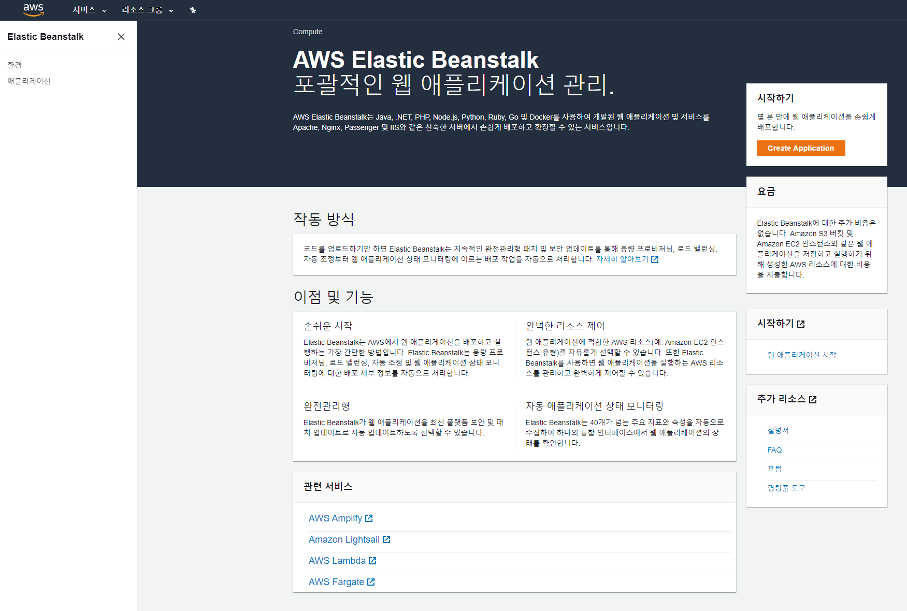
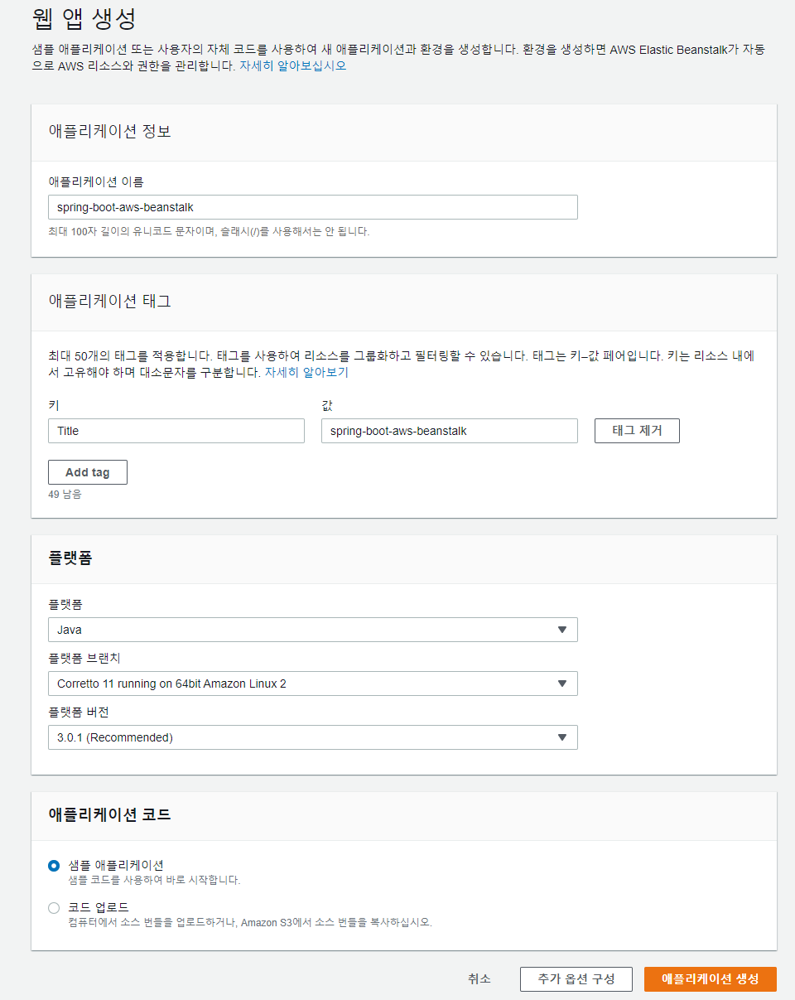
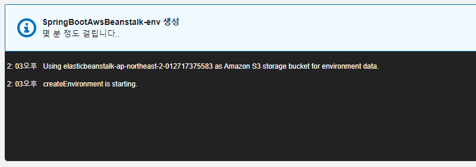
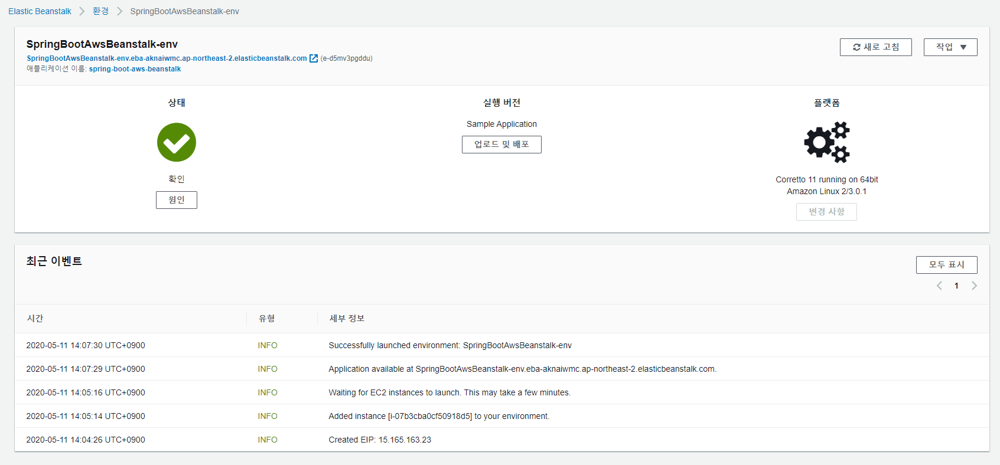
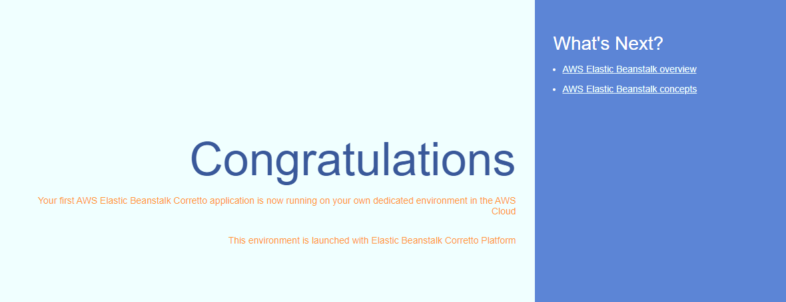
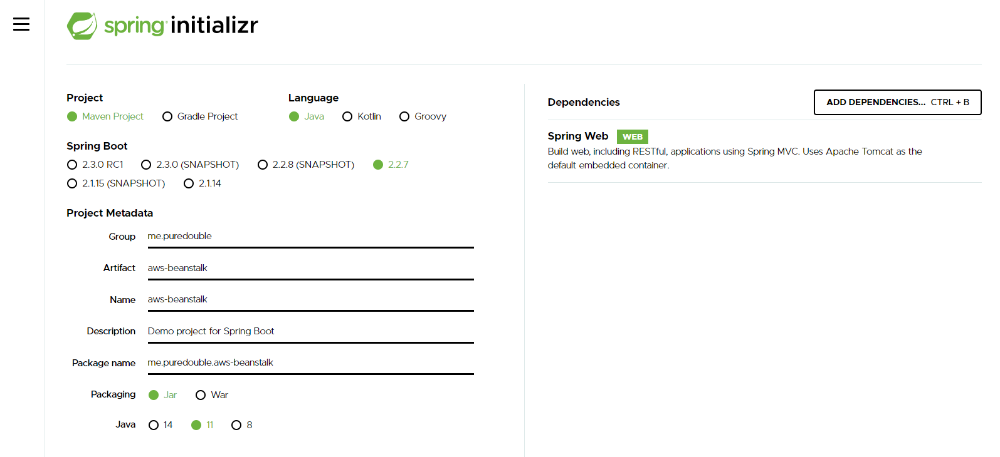
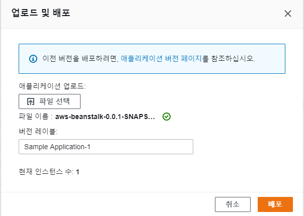

AWS Beanstalk는 AWS 의 다양한 서비스를 통합하여 인프라 구성 및 배포까지 자동으로 해주는 서비스입니다. 너무 간단한가요?  

배포를 자동으로 해준다는 것은 우리가 개발 할 때 비즈니스 로직에 집중 할 수 있는 시간이 늘어난다는 뜻일겁니다.  
지금 근무하는 회사가 대기업이라면 별도의 DevOps팀이 존재 하기 때문에 개발팀에서 인프라에 신경 쓸 일이 그렇게 많지 않을 수도 있겠지만, 규모가 작은 회사일수록 개발자에게 주어진 업무는 많아지겠죠.  
게다가 요즘의 클라이언트들은 이전과는 다르게 인프라적인 부분을 직접적으로 요구하는 경우가 점점 늘어나고 있습니다.  
예를 들면, 무중단 서비스를 구현해달라. 배포 시 서비스가 끊기지 않도록 해달라 등등...  
그러나 우리에게 시간은 한정적이고, 인프라까지 신경 쓰기에는 프로젝트 요구사항이 너무 많습니다. 언제나 그렇죠.  

그렇기 때문에 AWS Beanstalk을 사용해야 합니다. 우리의 시간은 소중하니까요.  


언제나 그렇듯 글자만 읽어보는 것 보다는 직접 해보는게 이해하기 쉽고 빠릅니다.  
[AWS Elastic Beanstalk 개발자 가이드](https://docs.aws.amazon.com/ko_kr/elasticbeanstalk/latest/dg/Welcome.html) 를 보아도 튜토리얼이 제일 위쪽에 있는 것을 볼 수 있습니다.  
그러므로 이번 포스팅에선 기본적인 튜토리얼을 따라 해보도록 하겠습니다.

documentation은 너무 내용이 길기 때문에 적당히 따라하기 쉽게 만들어 보겠습니다.  
제목에 나와있듯이 저는 자바 개발자이기 때문에 springboot로 만든 웹 서비스를 배포하도록 할 것입니다.  

## 1. 인스턴스 생성
우선 인스턴스를 만들겠습니다.  
AWS 서비스에서 Beanstalk을 찾아서 들어갑니다.  



최초 진입 시 위와 같은 화면이 나옵니다. Create Application 버튼을 눌러 애플리케이션을 생성 해줍니다.  



애플리케이션 이름 및 추가 하고 싶은 태그를 지정하여 적용합니다.  
애플리케이션 태그는 리소르 그룹화 및 필터링 시 사용 할 수 있습니다.  

플랫폼은 Java, 플랫폼 브랜치는 Java 11 을 사용 할 예정이기 때문에 Corretto 11로 선택 해줍니다.  
Corretto는 아마존에서 제공하는 java open jdk 입니다.  
플랫폼 버전은 추천하는 최신 버전을 선택하시면 됩니다.  

애플리케이션 코드는 우선 샘플 애플리케이션을 선택하여 기본 제공하는 화면을 본 뒤 새로 프로젝트를 생성하여 배포 해보기로 하겠습니다.  
추가 옵션 구성을 선택하면 새로 구성할 환경 설정을 미리 할 수 있습니다. 여기서는 넘어가겠습니다.  

이제 "애플리케이션 생성" 버튼을 눌러 애플리케이션을 생성합니다.  
버튼을 누르면 아래와 같은 화면이 나오면서 환경 생성을 진행합니다.  



5분정도의 시간이 소요 됩니다. 정상적으로 완료 되면 잠시 후 생성된 환경 대시보드가 보입니다.  



환경명 (SpringBootAwsBeanstalk-env) 아래 있는 주소를 클릭하여 배포된 샘플 프로그램을 확인 합니다.  



이제 새로운 앱을 생성하여 배포 하겠습니다.  
java 11로 springboot 웹서비스를 생성합니다.  

https://start.spring.io/ 에서 새로운 프로젝트를 만듭니다.  



저는 maven, java 11, 2.2.7, jar 설정으로 생성했습니다. web 의존성도 추가 해줍니다.  
프로젝트를 열고 src/main/resources/application.properties 파일에 포트를 수정합니다.  

```
server.port = 5000
```

Elastic Beanstalk는 nginx를 역방향 프록시로 사용하여 애플리케이션을 포트 80의 Elastic Load Balancing 로드 밸런서에 매핑합니다.  
기본적으로 Elastic Beanstalk는 요청을 포트 5000의 애플리케이션에 전달하도록 nginx 프록시를 구성합니다.  


이제 "hello aws beanstalk" 문자를 반환하는 controller를 하나 만들어 줍니다.  
```java
@RestController
public class HelloController {

    @GetMapping("")
    public String hello() {
        return "hello aws beanstalk";
    }

}
```

그리고 maven 패키징 합니다.  

```
mvn install
```

다시 aws console로 돌아가서 업로드 및 배포 버튼을 클릭합니다.  



파일 선택 버튼을 클릭하여 파일 선택 창에서 패키징 된 jar 파일을 선택합니다.  
버전 레이블에 적당한 버전명을 작성하고 배포 버튼을 클릭하면 배포가 완료됩니다.  
배포 시에도 약 2~3분 정도의 시간이 소요됩니다.  

배포가 완료되면 환경 상태가 다시 "확인"으로 돌아오게 됩니다.  
다시 애플리케이션 주소를 클릭하여 잘 배포 됐는지 확인 해봅니다.  


잘 나오는 것을 확인 할 수 있습니다.  

이렇게 생성한 환경은 "단일 인스턴스" 환경으로 구성되어 있지만, 약간의 설정 변경 만으로도 Auto Scaling 을 지원하는 환경도 손쉽게 구성 할 수 있습니다.  
Auto Scaling 환경 구성 및 다양한 환경 설정 작업은 앞으로 포스팅 예정 입니다.  


### 유의 사항
- AWS Elastic Beanstalk 로 생성한 환경은 AWS 서비스에 각각 등록 됩니다. 예를 들면 EC2 및 ELB 항목에도 자동으로 추가되는데, 절대로 각 서비스로 들어가서 설정을 변경하면 안됩니다. <span style="color:red">Elastic Beanstalk로 생성한 환경은 Elastic Beanstalk 서비스 환경에서만 수정해야 합니다.</span>
- 프로젝트 port number 설정을 5000으로 설정 해야 합니다. (기본 포트는 "PORT" 환경 변수를 통해 수정 가능합니다.)
- 플랫폼 버전은 한번 설정 하면 변경 할 수 없습니다.


### 참조
- [AWS Elastic Beanstalk 개발자 가이드](https://docs.aws.amazon.com/ko_kr/elasticbeanstalk/latest/dg/Welcome.html)


