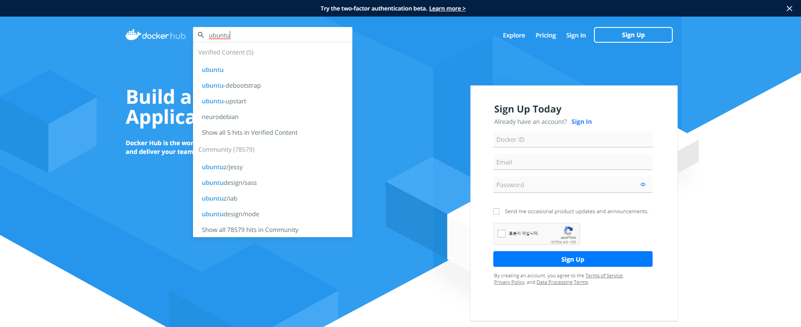
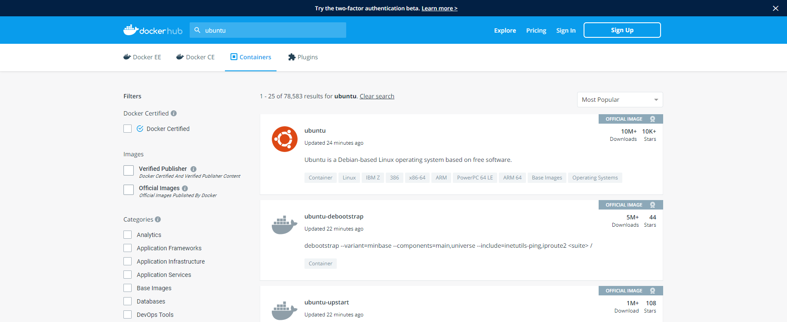
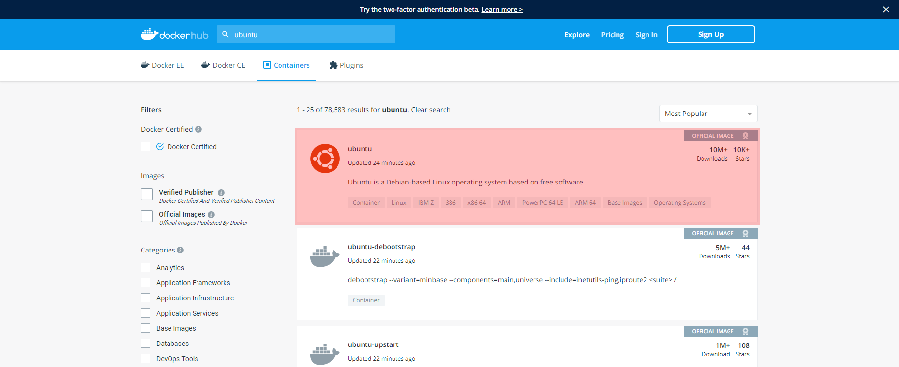
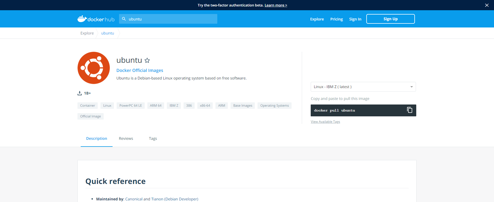
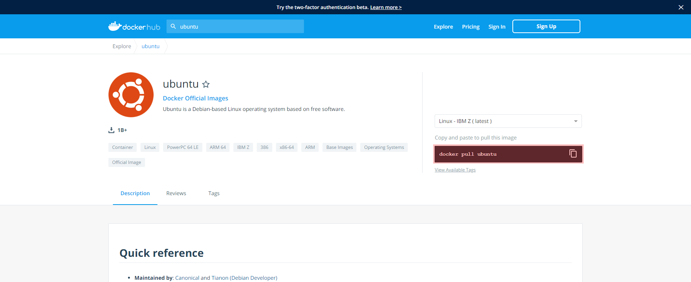
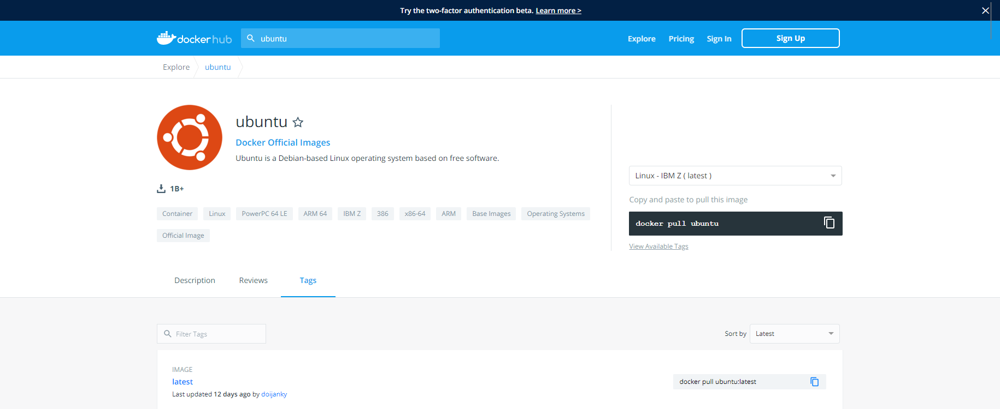
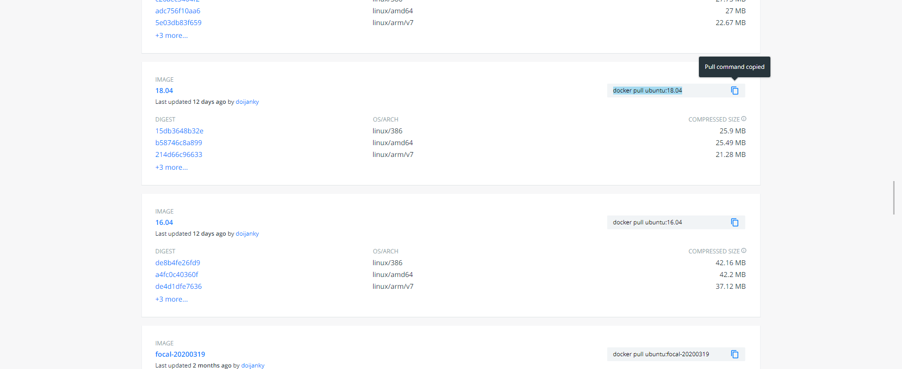

## **일단 귀여운 도커의 로고를 보고 넘어가도록 한다.**

사실 도커가 같은 종류의 소프트웨어 중에서 생존할 수 있었던 이유가  
정말 로고가 귀여워서 살아 남았다는 농담 섞인 이야기를 자주 들을 수 있다.  

도커를 사용하는 것에 대한 장점을 설명하기 위해서 예를 세 개 들겠다.

### ex 1)
> Ubuntu 18.04 환경의 개발 서버 7 개를 셋팅하시오.

### ex 2)
> 개발 서버 A 와 같은 설정의 신규 프로젝트가 4 개,  
> 개발 서버 B 와 같은 설정의 신규 프로젝트가 5 개가 계약되었다.  
> 각 특징에 맞게 개발 서버 총 9 개를 셋팅하시오.

### ex 3)
> 프로젝트 하나를 총 4 대의 서버에 배포하시오.   
> 단, 한 대는 Windows 서버.  
> 한 대는 CentOS 7.  
> 한 대는 AWS.  
> 한 대는 Ubuntu 18.04 다.
> 모두 Apache 로 Front-end 소스를 관리하고 OpenJDK 11 버전을 설치하고 SSH 설정을 해줘야 한다.
> 1 시간 안에 끝내지 못하면 클라이언트가 내가 있는 사무실로 출발한다.

일단 스트레스를 받았다면 심심하지 않은 진지한 사과의 말을 전하는 바이다.

위의 예제 1 번 같은 경우는 요즘은 서버마다 물리적인 공간을 갖는 경우가 드물지만  
그래도 각 서버마다 물리적인 공간이 필요한 사람에게 굉장히 와닿는 예제일 것이다.  
서버 7 대를 셋팅하려면 디스크 7 개. 메모리 7 개. 메인보드 7 개. 파워 7 개... 등  
7 대의 하드웨어 장비를 셋팅해야 하는 과정이 필요한 사람이라면  
Docker 는 다른 세상 이야기처럼 들릴 것이다.  
Docker 는 한 대에 설치하면 소프트웨어로 여러 서버를 구동할 수 있다.  
VMware 와 똑같네 라고 생각할 수 있지만 가장 큰 차이점은  
VMware 는 하나의 자원을 각각의 OS 에 나눠서 할당을 해주게 되며  
각각의 OS 는 할당된 자원을 넘어설 수 없다.  
하지만 도커의 경우 여러 컨테이너를 구동하더라도  
모든 컨테이너가 따로 할당해주지 않는 한  
하드웨어의 자원을 100% 활용한다.
그래서 자원 사용이 더 동적이다.  
그래서 하드웨어 한 곳에서 여러 서버를 관리하기에, 특히 개발 서버처럼  
수명이 짧은 서버들을 관리하기에는 더욱 관리하기도 쉽고  
생성, 삭제가 자유로우며 리소스도 절약할 수 있다.  
여기서 ***그럼 하드웨어 하나가 다운되면 다 다운되잖아*** 라고 말한다면  
그럼 하드웨어 모여있는 곳에 벼락 떨어지면 다 날아가잖아. 라고 대답할 수 있겠다.  
(어떤게 복구하는데 금액이 더 적게 들까?)

예제 2 번 같은 경우는 일단 필자도 스트레스 받고 있다는 점을 알아줬으면 감사하겠다.  
보통 똑같은 OS 의 서버를 설치하고 A 나 B 서버를 띄워놓고  
설정 파일을 하나하나 보면서 복사를 할 것이라고 생각한다.  
(이건 도커란 무엇인가 라는 초보용 포스팅이니까 고수분들 반박자제하기 바랍니다.<존칭을 썼다고.>)  
하지만 A 와 B 서버가 도커로 구성되어 있다면 이야기는 많이 달라진다.  
A 와 B 서버가 설정된 컨테이너 자체를 이미지로 변환하고 변환된 이미지 두 개를  
새로 구성해야할 서버의 개수만큼 실행해주면 된다. (따란~)  
정말 이게 끝이다.  

예제 3 번의 경우. 극단적인 예제를 들어서 스트레스를 안긴 점 기쁘다.  
필자는 겪어봤다. 저런 클라이언트... 겪어본 사람만 돌을 던져라.  
저런 경우 Apache 만 살펴봐도 각 서버마다 설치하는 과정조차 다르다.  
설치된 경로도 다르며, 설정해야할 파일 이름조차 다르다.  
Apache 만 해도 그런데, JDK 와 SSH 도 설정해야한다.  
도커를 이용하면 어떻게 되는지 알아보자.  
각각의 서버에 도커를 설치한다.  
물론 도커 설치도 서버마다 다르다.  
서버의 환경에 따라 각각 설정도 다르다.  
여기까지보면 다른 점이 없다.  
여기서 도커의 장점은 도커만 설치하면 된다는 것이다.  
4 대의 서버에 Apache, JDK, SSH 를 설정하는 것은 단순하게 숫자만 봤을 때  
12 번의 설치를 진행해야 한다.  
도커는 각 한 번씩만 하면 되니까 4 번이다.  
Apache? JDK? SSH? 전부 도커 이미지에 포함되어 있다.  
그냥 실행하면 된다.  

위의 예제들처럼 도커를 활용하면 물리적 공간, 비용, 시간 등을 절약할 수 있다.  
단점?  
필자가 도커를 처음 접하고 약 반 년정도가 지났는데.  
단 하나의 단점을 제외하고는 딱히 단점이라고 불릴만한 것이 전혀 없다.  
하나의 단점이 좀 크지만 그래도 하나니까 감수할 수 있다고 생각한다.  
하나의 단점? 도커를 벗어날 수 없다. (도커는 사랑이다.)

물론 도커도 깊게 접근하면 다른 서버들보다 공부할게 많아진다.  
뭐 예로 하나 뽑자면 Kubernetes...?  
하지만 지금은 몰라도 된다.  
넘어가자...  

도커를 설치하는 방법은 OS 마다 다르고  
OS 마다 UI 화면도 다르기때문에  
설치나 UI 를 활용한 진행은 하지 않는 것으로 하겠다.

도커가 설치되었다는 전제하에 기본 명령어를 살펴보도록 하겠다.

# Docker 기본 명령어

## 1. 이미지 가져오기
> 일단 가져오고 하고 싶은 이미지의 이름을 알아야 한다.  
> 만약 이미지 이름과 버전을 알고 있다면 다음 양식처럼 이미지를 가져올 수 있다.  
> REPOSITORY 는 이미지의 이름, TAG 는 이미지의 버전이다.
> ``` bash
> root@root:~# docker pull REPOSITORY:TAG
> ```
> 가져오고 싶은 이미지의 이름을 모르거나 docker 에서 제공하는지 모르겠다면  
> [Docker Hub]("https://hub.docker.com/") 에서 검색을 해서 찾으면 된다.  
> [Docker Hub]("https://hub.docker.com/") 에서 이미지를 찾는 방법은  
> 
> 
> 
> Docker hub 사이트에 접속한 후 (가입은 자유)
> 
> 
> 
> 원하는 이미지를 검색한다.
> 
> 
> 
> 그럼 검색된 목록이 보이는데 여기서 배포자를 확인하거나  
> 이미지의 상세 항목을 확인한 후 원하는 이미지를 선택하면 된다.  
> 필자는 ubuntu 에서 정식 배포한 이미지면서 아무런 추가 기능이 없는  
> 이미지를 가져오기 위해서 다음 항목을 선택했다.
> 
> 
> 
> 그럼 다음과 같은 상세 페이지가 보인다.
> 
> 
> 
> 여기서 마지막 버전을 가져오고 싶다면 아래 이미지에 표시된 영역의 코드를 복사하면 된다.
> 
> 
> 
> 하지만 특정 버전이나 LTS 버전같이 버전을 선택해서  
> 가져오고 싶다면 다음 이미지와 같이 Tag 탭으로 이동한다.
> 
> 
> 
> 그러면 배포된 모든 버전을 확인할 수 있다.  
> 여기서 원하는 버전을 선택해서 pull 코드를 복사하면 된다.
> 
> 
> 
> 그리고 터미널에서 복사한 코드를 실행하면 된다.
> ``` bash
> root@root:~# docker pull ubuntu:18.04
> ```
> 실행을 하면 이미지를 다운로드 하는 모습이 보인다.  

## 2. 이미지 목록 조회
> 다운로드한 이미지 목록을 보는 명령어는 간단하다.
> ``` bash
> root@root:~# docker images
> ```
> 입력하게 되면 목록이 보여지는데 다음과 같다.
> 
> |TITLE        |DESCRIPTION            |
> |-------------|-----------------------|
> |REPOSITORY   |이미지의 이름          |
> |TAG          |이미지의 버전          |
> |IMAGE ID     |이미지의 고유 아이디   |
> |CREATED      |이미지를 가져온 날짜   |
> |SIZE         |이미지의 용량          |
> 
> 이미지 목록 조회에서는 옵션에 대한 설명은 생략한다.  
> 굳이 옵션까지 설명하지 않더라도 충분한 정보를 조회할 수 있기 때문에  
> 만약 이미지 목록 조회에 대한 옵션에 대해서 궁금한 사용자는  
> [Docker Images Reference](https://docs.docker.com/engine/reference/commandline/images/) 를 확인하길 추천한다.

## 3. 컨테이너 생성
> 개인적으로 docker 명령어의 꽃이다. 옵션이 정말정말 많다.  
> 다 외울 생각하지 말고 그냥 문서 보면서 만드는게 정신건강에 이롭다.  
> 아무 옵션없이 실행하는 명령어를 일단 확인해보자.
> ``` bash
> root@root:~# docker run REPOSITORY:TAG
> ```
> 또는 이미지의 고유 아이디로도 컨테이너 생성이 가능하다.
> ``` bash
> root@root:~# docker run IMAGE ID
> ```
> 이렇게 작성해주면 docker 컨테이너가 하나 만들어지고 실행된다.  
> 하지만 사실 이렇게 실행하면 컨테이너가 하나일 때는 문제가 되지 않지만  
> 컨테이너가 여러개라면 문제가 발생하기 시작한다.  
> 예를 들어 포트를 80 과 443 포트를 사용하는 컨테이너 하나를 생성했다고 가정해보겠다.  
> 그리고 또 80 포트와 443 포트를 사용하는 컨테이너를 하나 더 생성했다고 가정해보겠다.  
> 80 포트로 접속을 하면 어떤 컨테이너를 보여줘야 하는가?  
> 그래서 컨테이너 외부 포트와 컨테이너 내부 포트를 나눠서 맵핑해야 관리가 편하다.  
> 컨테이너 생성하는 옵션들은 대부분이 위의 예제처럼 맵핑에 관련된 옵션들이다.  
> 그럼 이제 옵션들을 하나씩 차근차근 알아보기 싫다...  
> 그러니 자주 쓰이는 몇 개만 살펴보록 하겠다.  
> 그 외에는 검색해서 그때그때 옵션들을 확인하는 것을 추천한다.
> 
> ### ***--name***
> 컨테이너 이름을 지정할 때 사용하는 옵션.  
> 왠만하면 이름을 지정하는 것을 추천한다.  
> 안그러면 이미지 고유 아이디처럼 컨테이너도 고유 아이디가 생성되는데  
> 이름을 지정하지 않는다면 고유 아이디로 컨테이너에 접근을 해야한다.  
> 처음에 한 두개 있을때는 모르겠지만 여러개의 컨테이너를 관리할 때  
> 이름을 하나도 지정하지 않으면 나중에는 어떤게 어떤 컨테이너인지 구분하기 힘들어진다.
> 
> ### ***-d*** 또는 ***--detach***
> 컨테이너를 데몬 모드, 즉 백그라운드에서 실행하는 옵션  
> 컨테이너를 실행하는데 짧은 시간이 걸리면 상관 없지만  
> 컨테이너를 실행하는데 오랜 시간이 걸릴때 데몬 모드로 실행하지 않으면  
> 컨테이너가 실행될때까지 아무것도 못하고 실행되는 로그를 바라봐야 한다.
> 
> ***-d 옵션을 사용하지 않은 모습***  
> [](https://youtu.be/H_HCvY3xpmw)  
> ***이미지 클릭하면 youtube 영상으로 이동***  
> 
> 영상은 10배속으로 편집한 모습이다.  
> 실제로는 20분이 넘게 지속되다가 이정도면 충분하다고 생각되어 중단했다.  
> 다시 말하지만 중.단.했다.
> 
> ***-d 옵션을 사용한 모습***  
> [](https://youtu.be/tILPJPkcteU)  
> ***이미지 클릭하면 youtube 영상으로 이동***  
> 
> 영상은 재생속도를 편집하지 않았다.  
> 
> 위의 예제로 알 수 있듯이 ***--detach*** 옵션을 사용하면  
> 백그라운드에서 컨테이너가 실행되는 동안 다른 작업을 진행할 수 있다.
> 
> ### ***-i*** 또는 ***--interactive***
> 상호 입출력.
> 
> ### ***-t*** 또는 ***--tty***
> tty를 활성화하여 bash 쉘을 사용.  
> 
> #### ***-i & -t 각주***
> 터미널에서 접속해서 bash shell 을 사용하려는 경우  
> ***-i*** 와 ***-t*** 옵션을 기본적으로 추가해서 사용한다.
> 
> ### ***-p 또는 --publish***
> 컨테이너 외부 포트와 컨테이너 내부 포트를 맵핑하는 옵션.  
> ``` bash
> root@root:~# docker run -p OUTER_PORT:INNER_PORT
> ```
> 여러 포트를 맵핑하는 경우에는 반복적으로 옵션을 설정하면 된다.
> ``` bash
> root@root:~# docker run -p OUTER_PORT:INNER_PORT -p OUTER_PORT:INNER_PORT
> ```
> 
> ### ***-h*** 또는 ***--hostname***
> 컨테이너 host name 을 설정하는 옵션.  
> 일반적으로는 크게 차이가 없지만  
> 어떤 이미지는 hostname 을 설정해야 하는 경우도 있다.
> 
> ### ***--restart***
> 컨테이너가 종료되었을때 재시작 정책을 설정하는 옵션.
> ``` bash
> --restart no            # 컨테이너가 종료되더라도 재시작되지 않는 옵션.
> --restart on-failure:10 # 컨테이너가 종료되면 자동으로 재시작되고 재시작 시도 횟수를 지정할 수 있는 옵션.
> --restart always        # 컨테이너가 종료되면 자동으로 재시작을 시도하는 옵션.
> ```
>
> 여기까지가 필자가 자주 사용하는 ***docker run*** 옵션들이다.  
> 이외에도 많은 옵션을 제공하니 run 에 대해서 다른 옵션이 궁금하다면  
> [Docker Run Reference](https://docs.docker.com/engine/reference/run/) 를 한 번 읽어보는 것을 추천한다.  
> 필자가 자주 사용하는 옵션까지 사용한 run 코드의 형태는 다음과 같은 모양이 된다.
> ``` bash
> root@root:~# docker run -itd \
> > --name test
> > --hostname test.nextculture.kr \
> > --publish 10100:22 \
> > --publish 10101:3306 \
> > --publish 10102:6379 \
> > --publish 10103:8443 \
> > --publish 10104:8444 \
> > --publish 10105:8445 \
> > --restart always \
> > ubuntu:18.04
> ```

## 4. 컨테이너 생성 및 실행
> 이 부분은 사실 run 을 사용하면 사용할 일이 적지만 그래도 알고 있으면  
> 활용할 수 있는 여지가 있기때문에 이런게 있다 정도는 알고 있는게 좋을 것 같다.
> 
> ### 컨테이너 생성
> 
> ``` bash
> root@root:~# docker create [options...]
> ```
> run 명령과 옵션은 동일하다.  
> 실행이 되지 않는 차이만 있다.  
> 
> ### 컨테이너 실행
> 
> ``` bash
> root@root:~# docker start NAMES OR CONTAINER ID
> ```
> 컨테이너의 고유 이름 또는 고유 아이디로 컨테이너를 실행할 수 있다.

## 5. 컨테이너 접근하기
> Ubuntu 컨테이너를 생성했다면 이제 Docker 가 아닌  
> 생성한 Ubuntu 내부에 접속해서 설정을 해야하는데  
> 물론 이미지마다 설치된 항목들이 다르겠지만  
> SSH 도 설치가 안된 상황이라면 터미널로 접근할 수도 없으니  
> Docker 에서 바로 접근하는 방법을 알아보자.
> ``` bash
> root@root:~# docker exec -it [NAMES OR CONTAINER ID] [COMMAND]
> ```
> 위의 코드와 같이 컨테이너의 고유 정보 외에도 컨테이너 기본 명령어를 작성해줘야 한다.  
> 만약 기본 명령어가 뭔지 모른다면 [7. 컨테이너 목록 조회](#7.-컨테이너-목록-조회) 를 참고한다면 확인할 수 있다.  
> 
> 여기서 사용한 ***-i*** 와 ***-t*** 옵션은 run 에서 사용한 옵션과 동일하다.  
> run 에서 사용한 옵션과 다른 옵션도 있지만 잘 사용되지 않는다.  
> 만약 다른 옵션이 궁금하다면 [Docker Exec Reference](https://docs.docker.com/engine/reference/commandline/exec/) 를 참고하길 바란다.

## 6. 이미지 생성
> 컨테이너를 만들고 만들어진 컨테이너의 설정이 이전에 만든 컨테이너와 동일할 경우가 있다.  
> 이때 똑같은 이미지를 사용해서 컨테이너를 만들고 똑같은 설정을 반복하게 되는데  
> 이 과정이 정말 똑같거나 흡사해서 중복되는 항목들을 매번 설정하는 것에 대해서  
> 생산성이 굉장히 안좋다고 느껴질 수 있다.  
> 백번 공감할 수 있는 내용이고 이 부분을 해결하기 위해  
> 이미 있는 이미지가 아닌 컨테이너의 현재 상태 그대로 이미지화 시킬 수 있다.  
> 이미지를 생성하는 것은 위의 글처럼 중복되는 항목들을 미리 설정해서  
> 같은 설정을 반복하지 않기 위하여 이미지를 생성할 수도 있고,
> 백업을 위해서 생성할 수도 있으며 배포를 위해서 생성할 수도 있다.  
> 예를 들어 SSH 설정과 Apache 설정 그리고 Java 11 을 설정한 Ubuntu 컨테이너를 만들었다고 가정을 해보겠다.  
> 똑같은 설정을 해줘야 하는 상황이 발생한다면 이미 만들어진 위의 컨테이너를 이미지로 만들어서  
> 만들어진 이미지로 컨테이너를 생성한다면 똑같은 설정을 가진 컨테이너를 한 줄의 명령어로 복제할 수 있다.  
> 그래서 이 부분은 생산성 향상에 도움이 되기때문에 꼭 읽어보길 추천한다.  
> 컨테이너까지는 만들었다는 전제하에 진행을 하도록 하겠다.  
> ``` bash
> root@root:~# docker commit [NAMES OR CONTAINER ID] [REPOSITORY[:TAG]]
> ```
> 컨테이너를 이미지로 만들때 대상 컨테이너의 고유 아이디나 이름이 필요하고  
> 만들어질 이미지의 이름과 버전이 필요하다.  
> 그 외의 옵션은 선택항목이기 때문에 [Docker Commit Reference](https://docs.docker.com/engine/reference/commandline/commit/) 를 확인하고 작성하는 것을 추천한다.  
> 생성할 이미지를 docker hub 에 배포하는 방법에 대해서는  
> 도커에 대한 기본 설명이 아니라고 판단되어 다른 포스팅에서 설명하도록 하겠다.

## 7. 컨테이너 목록 조회
> 컨테이너 목록을 조회할 때도 옵션이 몇 가지 있다.  
> 기본적인 명령어는 아래 모습과 같다.  
> ``` bash
> root@root:~# docker ps
> ```
> 이때 보여지는 항목으로는
> 
> |TITLE        |DESCRIPTION                            |
> |-------------|---------------------------------------|
> |CONTAINER ID |컨테이너의 고유 아이디                 |
> |IMAGE        |컨테이너 생성에 사용된 이미지          |
> |COMMAND      |컨테이너 시작할 때 실행될 기본 명령어  |
> |CREATED      |컨테이너 생성 날짜                     |
> |STATUS       |컨테이너 상태                          |
> |PORTS        |컨테이너에서 사용하고 있는 포트 목록   |
> |NAMES        |컨테이너의 고유 이름                   |
> 
> 하지만 위의 명령어는 실행중인 컨테이너의 목록만 보여준다.  
> 
> ### ***-a 또는 --all***
> 이 옵션은 중지된 컨테이너 목록까지 보여준다.
> 
> ### ***-f 또는 --filter***
> 이 옵션은 컨테이너를 색인해서 목록을 보여준다.  
> 색인할 수 있는 항목에 대해서는 [Docker PS Filtering](https://docs.docker.com/engine/reference/commandline/ps/#filtering) 를 확인하면 자세히 나와있으니 참고바란다.
> 
> ### ***--format***
> 이 옵션은 목록에서 보여지는 항목을 지정할 수 있다.  
> 자세한 항목에 대한 설명은 [Docker PS Formatting](https://docs.docker.com/engine/reference/commandline/ps/#formatting) 를 확인하면 자세히 나와있으니 참고바란다.
> 
> ### ***-n 또는 --last 그리고 숫자***
> 아래 예제를 예로 들어 설명하도록 하겠다.
> ``` bash
> root@root:~# docker ps -n 3
> ```
> 위의 코드처럼 사용하면 마지막으로 생성된 컨테이너 3 개의 목록을 보여준다.  
> 숫자 부분은 다른 숫자로 대체 가능하다.
> 
> ### ***-l 또는 --latest***
> 이 옵션을 사용하면 가장 마지막에 생성한 컨테이너 하나만 보여진다.
> 
> ### ***--no-trunc***
> 컨테이너 고유 아이디는 원래 긴 문자열인데  
> 화면에 표시될 때 길어서 불편하므로 짧은 이름으로 표시된다.  
> 이 옵션을 사용하면 고유 아이디가 원래 이름으로 표시된다.
> 
> ### ***-q 또는 --quiet***
> 이 옵션은 숫자 아이디만 보여준다.
> 
> ### ***-s 또는 --size***
> 이 옵션 컨테이너의 용량까지 보여준다.
> 
> 필자가 자주 사용하는 옵션까지 사용한 ps 코드의 형태는 다음과 같은 모양이 된다.
> ``` bash
> root@root:~# docker ps --no-trunc --format "{{.Names}} : {{.Status}} : {{.Command}} : {{.Image}}"
> ```

## 8. 컨테이너 중지
> ``` bash
> root@root:~# docker stop NAMES OR CONTAINER ID
> ```
> 컨테이너의 고유 이름 또는 고유 아이디로 컨테이너를 중지할 수 있다.

## 9. 컨테이너 삭제
> ``` bash
> root@root:~# docker rm NAMES OR CONTAINER ID
> ```
> 컨테이너의 고유 이름 또는 고유 아이디로 컨테이너를 삭제할 수 있다.  
> 이때 컨테이너는 중지된 상태여야 삭제가 가능하다.

## 10. 이미지 삭제
> ``` bash
> root@root:~# docker rmi REPOSITORY:TAG OR IMAGE ID
> ```
> 이미지의 이름과 버전 또는 고유 아이디로 이미지를 삭제할 수 있다.  
> 이때 삭제하려는 이미지를 사용해서 생성된 컨테이너가 없어야 삭제가 가능하다.  
> 그래서 이미지를 삭제할 때 삭제할 이미지를 사용하는 모든 컨테이너도 삭제하는 옵션이 있다.
> ``` bash
> root@root:~# docker rmi -f REPOSITORY:TAG OR IMAGE ID
> ```

## 11. 그 외의 도커 명령어
> 지금까지 설명한 11 개의 명령어를 제외하더라도 많은 명령어가 존재한다.  
> 지금까지 설명한 것만으로도 필자는 개발 서버정도는 충분히 관리가 가능했다.  
> Docker 로 실제로 외부 사용자에게 서비스를 해본적은 없기때문에  
> 위의 명령어로 충분하다고 장담할 수는 없다.  
> 그래서 [Docker CLI Reference](https://docs.docker.com/engine/reference/run/) 를 시간이 된다면 한 번 읽어보는 것을 추천한다.