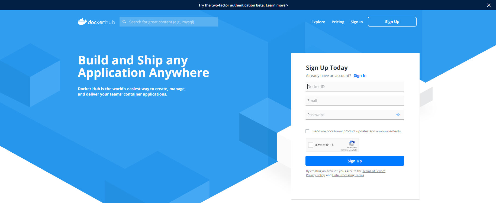

# Docker 란?


# Docker 기본 명령어

## 1. 이미지 가져오기
> 일단 가져오고 하고 싶은 이미지의 이름을 알아야 한다.  
> 만약 이미지 이름과 버전을 알고 있다면 다음 양식처럼 이미지를 가져올 수 있다.  
> REPOSITORY 는 이미지의 이름, TAG 는 이미지의 버전이다.
> ``` bash
> root@root:~# docker pull REPOSITORY:TAG
> ```
> 가져오고 싶은 이미지의 이름을 모르거나 docker 에서 제공하는지 모르겠다면  
> [Docker Hub]("https://hub.docker.com/") 에서 검색을 해서 찾으면 된다.  
> [Docker Hub]("https://hub.docker.com/") 에서 이미지를 찾는 방법은  
> 
> Docker hub 사이트에 접속한 후 (가입은 자유)
> 
> 원하는 이미지를 검색한다.
> 
> 그럼 검색된 목록이 보이는데 여기서 배포자를 확인하거나  
> 이미지의 상세 항목을 확인한 후 원하는 이미지를 선택하면 된다.  
> 필자는 ubuntu 에서 정식 배포한 이미지면서 아무런 추가 기능이 없는  
> 이미지를 가져오기 위해서 다음 항목을 선택했다.
> 
> 그럼 다음과 같은 상세 페이지가 보인다.
> 
> 여기서 마지막 버전을 가져오고 싶다면 아래 이미지에 표시된 영역의 코드를 복사하면 된다.
> 
> 하지만 특정 버전이나 LTS 버전같이 버전을 선택해서  
> 가져오고 싶다면 다음 이미지와 같이 Tag 탭으로 이동한다.
> 
> 그러면 배포된 모든 버전을 확인할 수 있다.  
> 여기서 원하는 버전을 선택해서 pull 코드를 복사하면 된다.
> 
> 그리고 터미널에서 복사한 코드를 실행하면 된다.
> ``` bash
> root@root:~# docker pull ubuntu:18.04
> ```
> 실행을 하면 이미지를 다운로드 하는 모습이 보인다.  

## 2. 이미지 목록 조회
> 다운로드한 이미지 목록을 보는 명령어는 간단하다.
> ``` bash
> root@root:~# docker images
> ```
> 입력하게 되면 목록이 보여지는데  
> REPOSITORY 는 이미지의 이름  
> TAG 는 이미지의 버전  
> IMAGE ID 는 이미지의 고유 아이디  
> CREATED 는 이미지를 가져온 날짜  
> SIZE 는 이미지의 용량이다.

## 3. 컨테이너 생성
> 개인적으로 docker 명령어의 꽃이다. 옵션이 정말정말 많다.  
> 다 외울 생각하지 말고 그냥 문서 보면서 만드는게 정신건강에 이롭다.  
> 아무 옵션없이 실행하는 명령어를 일단 확인해보자.
> ``` bash
> root@root:~# docker run REPOSITORY:TAG
> ```
> 또는 이미지의 고유 아이디로도 컨테이너 생성이 가능하다.
> ``` bash
> root@root:~# docker run IMAGE ID
> ```
> 이렇게 작성해주면 docker 컨테이너가 하나 만들어지고 실행된다.  
> 하지만 사실 이렇게 실행하면 컨테이너가 하나일 때는 문제가 되지 않지만  
> 컨테이너가 여러개라면 문제가 발생하기 시작한다.  
> 예를 들어 포트를 80 과 443 포트를 사용하는 컨테이너 하나를 생성했다고 가정해보겠다.  
> 그리고 또 80 포트와 443 포트를 사용하는 컨테이너를 하나 더 생성했다고 가정해보겠다.  
> 80 포트로 접속을 하면 어떤 컨테이너를 보여줘야 하는가?  
> 그래서 컨테이너 외부 포트와 컨테이너 내부 포트를 나눠서 맵핑해야 관리가 편하다.  
> 컨테이너 생성하는 옵션들은 대부분이 위의 예제처럼 맵핑에 관련된 옵션들이다.  
> 그럼 이제 옵션들을 하나씩 차근차근 알아보기 싫다...  
> 그러니 자주 쓰이는 몇 개만 살펴보록 하겠다.  
> 그 외에는 검색해서 그때그때 옵션들을 확인하는 것을 추천한다.
> 
> ### ***--name***
> 컨테이너 이름을 지정할 때 사용하는 옵션.  
> 왠만하면 이름을 지정하는 것을 추천한다.  
> 안그러면 이미지 고유 아이디처럼 컨테이너도 고유 아이디가 생성되는데  
> 이름을 지정하지 않는다면 고유 아이디로 컨테이너에 접근을 해야한다.  
> 처음에 한 두개 있을때는 모르겠지만 여러개의 컨테이너를 관리할 때  
> 이름을 하나도 지정하지 않으면 나중에는 어떤게 어떤 컨테이너인지 구분하기 힘들어진다.
> 
> ### ***-d*** 또는 ***--detach***
> 컨테이너를 데몬 모드, 즉 백그라운드에서 실행하는 옵션  
> 컨테이너를 실행하는데 짧은 시간이 걸리면 상관 없지만  
> 컨테이너를 실행하는데 오랜 시간이 걸릴때 데몬 모드로 실행하지 않으면  
> 컨테이너가 실행될때까지 아무것도 못하고 실행되는 로그를 바라봐야 한다.
> { % youtube https://www.youtube.com/watch?v=G33WiEktUo8 % }
>
> <iframe width="100%" src="https://www.youtube.com/embed/H_HCvY3xpmw?list=PLOQOA37IEyTTDLZ2yA4HsOXDBQvL6Hw97" frameborder="0" allow="accelerometer; autoplay; encrypted-media; gyroscope; picture-in-picture" allowfullscreen></iframe>
> 
> ***-d 옵션을 사용하지 않은 모습***  
> 영상은 10배속으로 편집한 모습이다.  
> 실제로는 20분이 넘게 지속되다가 이정도면 충분하다고 생각되어 중단했다.  
> 다시 말하지만 중.단.했다.
> 
> <iframe width="100%" src="https://www.youtube.com/embed/tILPJPkcteU?list=PLOQOA37IEyTTDLZ2yA4HsOXDBQvL6Hw97" frameborder="0" allow="accelerometer; autoplay; encrypted-media; gyroscope; picture-in-picture" allowfullscreen></iframe>
> 
> ***-d 옵션을 사용한 모습***  
> 영상은 재생속도를 편집하지 않았다.  
> 
> 위의 예제로 알 수 있듯이 ***--detach*** 옵션을 사용하면  
> 백그라운드에서 컨테이너가 실행되는 동안 다른 작업을 진행할 수 있다.
> 
> ### ***-i*** 또는 ***--interactive***
> 상호 입출력.
> 
> ### ***-t*** 또는 ***--tty***
> tty를 활성화하여 bash 쉘을 사용.  
> 
> #### ***-i & -t 각주***
> 터미널에서 접속해서 bash shell 을 사용하려는 경우  
> ***-i*** 와 ***-t*** 옵션을 기본적으로 추가해서 사용한다.
> 
> ### ***-p 또는 --publish***
> 컨테이너 외부 포트와 컨테이너 내부 포트를 맵핑하는 옵션.  
> ``` bash
> root@root:~# docker run -p OUTER_PORT:INNER_PORT
> ```
> 여러 포트를 맵핑하는 경우에는 반복적으로 옵션을 설정하면 된다.
> ``` bash
> root@root:~# docker run -p OUTER_PORT:INNER_PORT -p OUTER_PORT:INNER_PORT
> ```
> 
> ### ***-h*** 또는 ***--hostname***
> 컨테이너 host name 을 설정하는 옵션.  
> 일반적으로는 크게 차이가 없지만  
> 어떤 이미지는 hostname 을 설정해야 하는 경우도 있다.
> 
> ### ***--restart***
> 컨테이너가 종료되었을때 재시작 정책을 설정하는 옵션.
> ``` bash
> --restart no            # 컨테이너가 종료되더라도 재시작되지 않는 옵션.
> --restart on-failure:10 # 컨테이너가 종료되면 자동으로 재시작되고 재시작 시도 횟수를 지정할 수 있는 옵션.
> --restart always        # 컨테이너가 종료되면 자동으로 재시작을 시도하는 옵션.
> ```
>
> 여기까지가 필자가 자주 사용하는 ***docker run*** 옵션들이다.  
> 이외에도 많은 옵션을 제공하니 run 에 대해서 다른 옵션이 궁금하다면  
> [Docker Run Reference](https://docs.docker.com/engine/reference/run/) 를 한 번 읽어보는 것을 추천한다.  
> 필자가 자주 사용하는 옵션까지 사용한 run 코드의 형태는 다음과 같은 모양이 된다.
> ``` bash
> root@root:~# docker run -itd \
> > --name test
> > --hostname test.nextculture.kr \
> > --publish 10100:22 \
> > --publish 10101:3306 \
> > --publish 10102:6379 \
> > --publish 10103:8443 \
> > --publish 10104:8444 \
> > --publish 10105:8445 \
> > --restart always \
> > ubuntu:18.04
> ```

## . 컨테이너 목록 조회
> ``` bash
> root@root:~# docker ps
> ```

## . 컨테이너 삭제

## . 이미지 삭제

<script>
    function videoScaling() {
        /*document.querySelector('#docker-run-without-detach').style.width = document.querySelector(".page__content").offsetWidth + 'px';*/

        document.querySelectorAll('iframe').forEach(function(_element) {
            _element.style.height = (Math.ceil(_element.offsetWidth / 16) * 9) + 'px';
        });
    }

    window.addEventListener('resize', videoScaling);

    videoScaling();
</script>